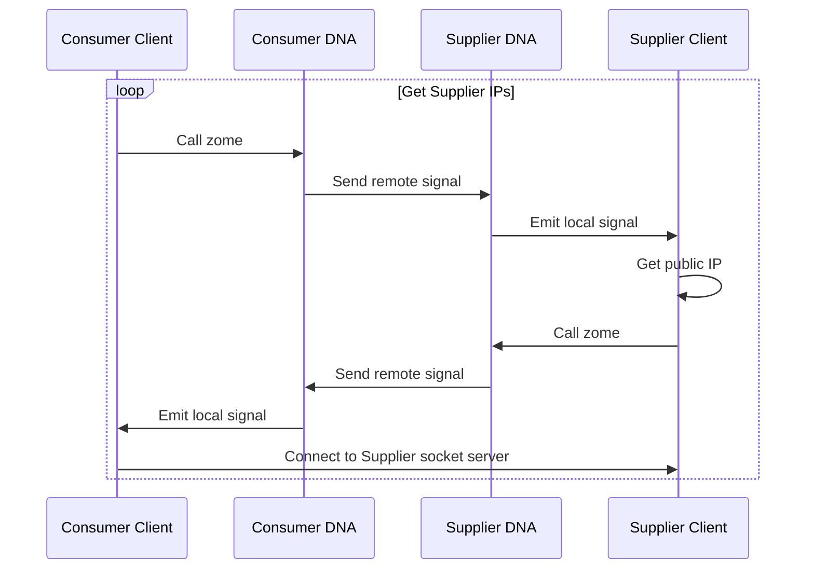

# Supply Agreement Socket Connection
Each consumer nanogrid needs to have a real time connection to their suppliers to be able to ask the supplier if they have power for sale. Suppliers keep a traqck of the amount of excess power they have available during each power usage period - typically 5 minutes. Each time a consumer buys some power the amount available is reduced by the amount sold, which means this has to be synchronous so the supplier does not oversell.

The IOEN Protocol connects consumers to suppliers with a socket connection that enables two way real time communication. Holochain provides an excellent way for consumers and suppliers to send each other signals. These signals are used by the IOEN Protocol to discover the public IP Address and create a new socket connection.

