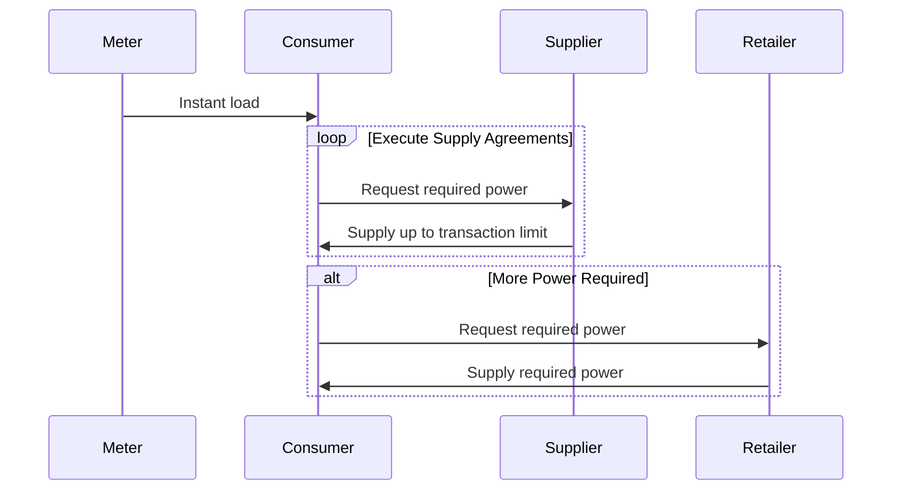

# Reconcile Power Requirements
Every interval (5 minutes) each nanogrid either has power to spare or needs power to satisfy it's load. A nanogrid that needs power will execute it's list of supply agreements with neighbours until it's load is satisfied.

